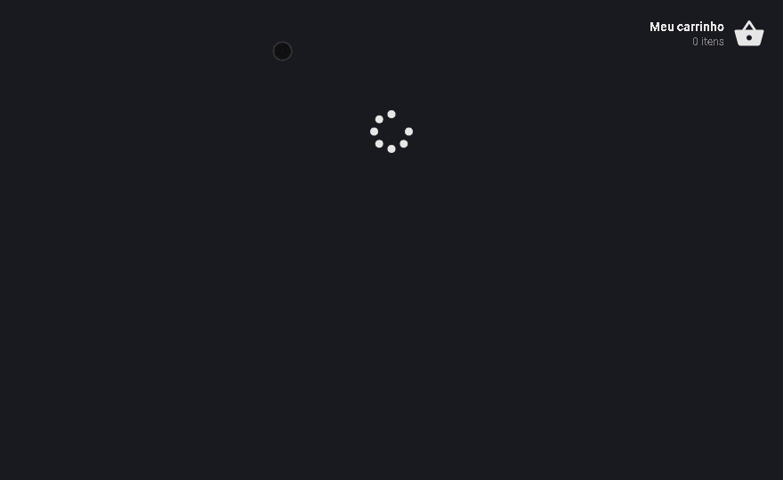

# Rocketshoes • Web

Aplicação Front-End responsiva para um e-commerce de venda de tênis. Feita com ReactJS, Redux e Redux Saga. A aplicação consome uma REST API fake e permite criar, listar, atualizar ou remover itens (CRUD) ao carrinho de compras.

Essa aplicação consome o mesmo Back-end da [versão Mobile](https://github.com/cafecomlucas/Rocketshoes_Mobile).

Passo a passo documentado em: https://github.com/cafecomlucas/Rocketshoes_Web/blob/master/_steps.md



---

## Como iniciar

### Versão online

Acesse o endereço [rocketshoesapp.herokuapp.com](https://rocketshoesapp.herokuapp.com/)

### Localmente

Clone o repositório, acesse o diretório, instale as dependências e inicie a aplicação:

```bash
git clone https://github.com/cafecomlucas/Rocketshoes.git
cd Rocketshoes
yarn
yarn android
```

(é necessário estar online para consumir a REST API)

---

## Rotas da REST API fake

- Produtos: [rocketshoesapi.herokuapp.com/products](https://rocketshoesapi.herokuapp.com/products)
- Estoque: [rocketshoesapi.herokuapp.com/stock](https://rocketshoesapi.herokuapp.com/stock)

---

## Funcionalidades

- Configuração do padrão de código (com EditorConfig, ESLint e Prettier);
- Configuração do debugger externo Reactotron (com o plugin do Redux Saga);
- Roteamento no Front-End através do React Router DOM;
- Configuração das rotas `/` e `/cart`;
- Responsividade e utilização do Flexbox;
- Configuração do Back-end que serve uma REST API (fake);
- Busca de dados na API através de requisições assíncronas;
- Listagem de produtos no componente `Home` (rota `/`), com imagem, título e preço de cada um;
- Utilização de ACTIONS/REDUCERS do Redux para adicionar ou modificar o estado global;
- Adição de produtos ao estado global carrinho no componente `Home`;
- Exibição da quantidade total de produtos do carrinho no cabeçalho;
- Exibição da quantidade individual de cada produto no componente `Home`;
- Listagem de produtos do carrinho no componente `Cart` (rota `/cart`), com imagem, descrição, preço, quantidade, subtotal em cada um;
- Utilização do Redux Saga para fazer chamada a API buscando mais detalhes do produto antes de adicioná-lo ao carrinho;
- Utilização do Redux Saga para checar estoque antes de adicionar produto ao carrinho;
- Utilização do Redux Saga para feedback ao usuário mostrando ícones e alterando estilizações quando a aplicação estiver carregando;
- Exibição de mensagem de erro ao constatar que não existem mais produtos disponíveis no estoque após busca na API.
